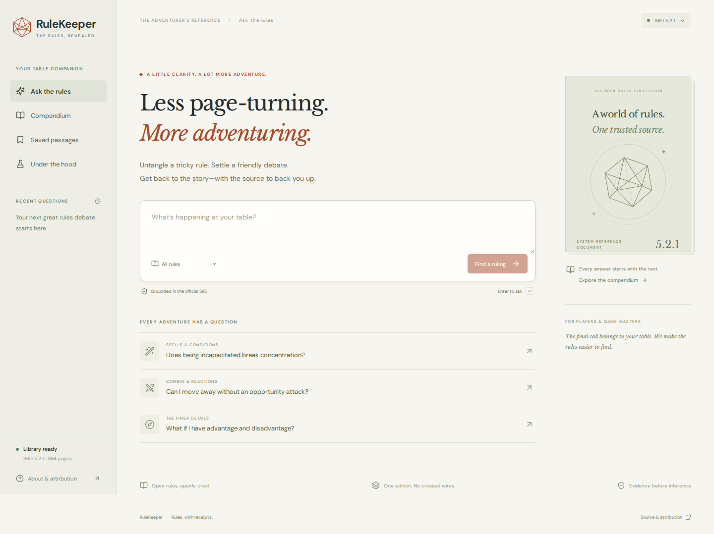
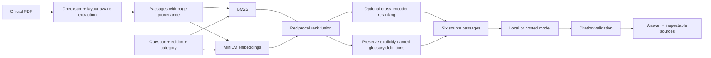

# RuleKeeper

**Less page-turning. More adventuring.**

[](https://github.com/williamcfrancis/rulekeeper/actions/workflows/ci.yml)


A tabletop rules assistant that retrieves evidence from the official **D&D SRD 5.2.1**, composes an explanation, and links each citation to the original page. Built as a practical, inspectable retrieval-augmented generation system.



*Screenshot from the passing browser test run. [Mobile view](docs/screenshot-mobile.png) · [Architecture](docs/architecture.md) · [Measured retrieval results](eval/results.json)*

> “If a creature is both prone and grappled, can it stand up?”
>
> The useful answer requires retrieving both conditions, noticing that grappling sets Speed to 0, and connecting that to the rule for standing from Prone. RuleKeeper shows its source passages so the interaction can be checked.

## What you can do

- Ask a rules question in plain English and inspect the retrieved evidence.
- Open a citation to read the passage, then jump to the original PDF page.
- Browse the full compendium by rule name and category.
- Bookmark passages and revisit recent questions in your browser.
- Inspect retrieval mode, candidate count, reranking, timing, and provider for each answer.
- Compare lexical, semantic, hybrid, and reranked retrieval using a reproducible question set.
- Run generation locally with Qwen3 and llama.cpp, or configure a hosted model.

With no answer provider configured, the application works in **source-excerpt mode**. This is retrieval without generative synthesis, and the UI labels it accordingly. No API key is needed for indexing, search, the compendium, or evaluation.

## The RAG pipeline



The backend uses **Python, FastAPI, FastEmbed/ONNX, BM25, and NumPy**. The frontend uses **React, TypeScript, and Vite**, with self-hosted fonts and original SVG/CSS artwork.

Exact vector search is intentional: the SRD produces about 3,000 passages, so a normalized matrix is small and easy to reproduce. The [architecture notes](docs/architecture.md) explain chunking, edition filters, reranking, fallback behavior, and tradeoffs.

## Quick start

Requirements: **Python 3.11–3.13** and **Node.js 22.12+**. Python 3.13 and Node 24 were used for the Windows build. First setup needs internet access to download the public PDF, embedding/reranking weights, and packages.

```powershell
git clone https://github.com/williamcfrancis/rulekeeper.git
cd rulekeeper
python -m venv .venv
.\.venv\Scripts\python.exe -m pip install -e ".[dev]"
.\.venv\Scripts\python.exe -m rulekeeper ingest
cd web
npm ci
npm run build
cd ..
.\.venv\Scripts\python.exe -m rulekeeper serve
```

Open **http://127.0.0.1:8000**. After setup, Windows users can also double-click **Start RuleKeeper.cmd**; it reuses running services and opens the app.

On macOS/Linux, create and activate `.venv`, then run `pip install -e '.[dev]'`, `rulekeeper ingest`, the same npm commands, and `rulekeeper serve`.

The PDF checksum is pinned. If it changes upstream, ingestion stops rather than silently changing the evidence. Stop the app before rebuilding its index.

## Enable local generation

The optional Windows installer downloads a pinned llama.cpp runtime and **Qwen3-4B Q4_K_M** into `.local/`. The model is about 2.5 GB; reserve additional memory for the runtime and context. Vulkan requires a compatible GPU/driver. CPU mode is also available and is slower.

```powershell
.\.venv\Scripts\python.exe scripts\setup_local_model.py --backend vulkan
Copy-Item .env.example .env
```

Set the following in `.env`, then restart RuleKeeper:

```dotenv
RULEKEEPER_PROVIDER=local
RULEKEEPER_LOCAL_BASE_URL=http://127.0.0.1:8081/v1
RULEKEEPER_LOCAL_MODEL=qwen3-4b
```

Use `--backend cpu` if you do not have a compatible GPU. The launcher remembers the installed backend. Do not run another model server on port 8081 at the same time.

For a separately installed llama.cpp server on another OS:

```bash
llama-server -hf Qwen/Qwen3-4B-GGUF:Q4_K_M --host 127.0.0.1 --port 8081 --alias qwen3-4b -c 6144 --jinja
```

The request enables Qwen3 reasoning and constrains the final output to JSON containing selected source clauses and a cited answer. The server resolves clause pointers to the original text. Compatible servers may require their own model name and settings; the bundled llama.cpp route is the tested local integration.

## Optional hosted generation

Set `RULEKEEPER_PROVIDER=openai`, `OPENAI_API_KEY`, and an explicit `RULEKEEPER_OPENAI_MODEL` in the server's environment or `.env`. The implementation uses the [Responses API](https://developers.openai.com/api/docs/guides/text) with `store=false`. Credentials never enter the browser bundle.

The hosted provider incurs usage charges and has not been tested with a live paid account in this checkout. Provider failures fall back to clearly labeled source excerpts. A valid citation reference does not prove that a model's statement follows from the cited passage.

## Evaluate and test

```powershell
.\.venv\Scripts\python.exe -m pytest -q --basetemp=.local/pytest-temp
.\.venv\Scripts\ruff.exe check src tests scripts
.\.venv\Scripts\python.exe -m rulekeeper evaluate --split dev
.\.venv\Scripts\python.exe -m rulekeeper evaluate --split test
```

There are **36 authored retrieval questions**: six development questions and 30 test questions, including several interactions requiring more than one source. Required evidence groups specify a title and supporting phrase. Results include the corpus hash, per-question retrieved IDs, warm retrieval latency, recall@6, and MRR. Read the complete [results](eval/results.json) and [methodology](docs/architecture.md#evaluation).

The benchmark is deliberately small. It measures retrieval of labeled passages, **not** generated-answer accuracy or performance on arbitrary player questions. Reranking is configurable because it adds substantial CPU latency and does not improve every query. Results are displayed unchanged in the app's “Under the hood” page.

Unit/API tests run without a model download or API key. They cover edition isolation, corpus integrity, layout extraction, citation and clause validation, provider fallback, input bounds, and the request-to-source path. CI also builds the full corpus and runs real browser journeys at desktop and mobile sizes, including source lookup and bookmark persistence.

With the local model running, `python scripts/verify_live.py` checks four generated answers and three abstention cases. It records the complete responses locally for manual review. See the [verification notes](docs/verification.md) for the observed failure that motivated definition preservation and the limits of these checks.

## Development

Run `rulekeeper serve` from the project root. In a second terminal, run `npm run dev` inside `web/`; Vite proxies `/api` to port 8000. The production server serves the compiled frontend itself. API documentation is available at `/docs`.

```text
src/rulekeeper/       ingestion, retrieval, generation, API, evaluation
web/                 React application
tests/               isolated unit and API tests
eval/                labeled questions and measured results
scripts/             local model setup and Windows launcher support
docs/                architecture and verification notes
data/                generated PDF/index/model cache (ignored by Git)
.local/              optional model runtime and local logs (ignored by Git)
```

`compose.yaml` and the multi-stage Dockerfile provide an alternative source-excerpt deployment with a persistent data volume. The image builds the UI, downloads/indexes the source on first startup, and binds the published port to loopback. Docker was not available on the development machine; this route is provided but not locally runtime-tested.

## Boundaries worth knowing

- The library is **SRD 5.2.1**, not every published D&D book. There is no edition comparison or house-rule ingestion in this release.
- Small local models can make mistakes. Read the actual source for a consequential ruling; the game master has the final call.
- Tables are flattened during extraction and can lose structure. Open the PDF for table-heavy questions.
- Unsupported editions and weak retrieval lead to an evidence-gap response. That gate is heuristic, not a guarantee that all unsupported questions are rejected.
- Recent questions and bookmarks use browser localStorage. Generated answers are never added to the source corpus.
- This is a local application. Add authentication, rate/spend controls, and deployment hardening before making a paid provider publicly accessible.

## Source and license

Original application code is [MIT licensed](LICENSE). SRD material is CC BY 4.0; fonts, model weights, and runtime components retain their own licenses. See [third-party notices](THIRD_PARTY_NOTICES.md).

This work includes material from the System Reference Document 5.2.1 (“SRD 5.2.1”) by Wizards of the Coast LLC, available at https://www.dndbeyond.com/srd. The SRD 5.2.1 is licensed under the Creative Commons Attribution 4.0 International License, available at https://creativecommons.org/licenses/by/4.0/legalcode.
