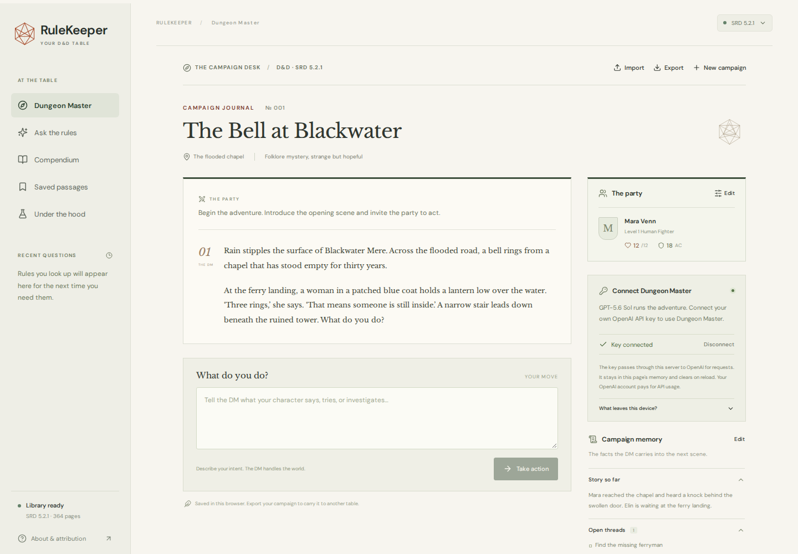
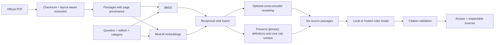

# RuleKeeper

**A Dungeon Master and a cited D&D rules reference.**

[](https://github.com/williamcfrancis/rulekeeper/actions/workflows/ci.yml)


A local D&D companion with two connected jobs: run an adventure with an AI Dungeon Master, and make the rules behind a ruling easy to inspect. The Dungeon Master uses your OpenAI API key with **[GPT-5.6 Sol](https://developers.openai.com/api/docs/models/gpt-5.6-sol)**. RuleKeeper retrieves evidence from the official **D&D SRD 5.2.1**, with citations that open the passage and original PDF page.

The campaign journal, party details, and editable memory keep the adventure coherent between turns. Retrieved rules remain separate from the story the model invents. This is a practical retrieval-augmented generation project with inspectable context, real dice rolls, and explicit limits on what citations can establish.



*Gameplay interface captured by the [passing browser test run](https://github.com/williamcfrancis/rulekeeper/actions/runs/36284985051). Narration and key connection use test fixtures; this is not a captured live model response. [Mobile view](docs/screenshot-dm-mobile.png) · [Campaign setup](docs/screenshot-dm-setup.png) · [Architecture](docs/architecture.md)*

> “If a creature is both prone and grappled, can it stand up?”
>
> The useful answer requires retrieving both conditions, noticing that grappling sets Speed to 0, and connecting that to the rule for standing from Prone. RuleKeeper shows its source passages so the interaction can be checked.

## What you can do

- Create a campaign, describe the party, and ask the Dungeon Master to open the first scene.
- Describe what your characters try, roll when an outcome is uncertain, and continue from the result.
- Review the journal and edit campaign memory when the model misses a detail or the table changes a ruling.
- Resume a campaign in the same browser, or export and import a campaign JSON file.
- Ask a rules question in plain English and inspect the retrieved evidence.
- Open a citation to read the passage, then jump to the original PDF page.
- Browse the full compendium by rule name and category.
- Bookmark passages and revisit recent questions in your browser.
- Inspect retrieval mode, candidate count, reranking, timing, and provider for each answer.
- Compare lexical, semantic, hybrid, and reranked retrieval using a reproducible question set.
- Generate rules answers locally with Qwen3 and llama.cpp, or configure a hosted model.

No API key is needed for indexing, search, the compendium, or retrieval evaluation. With no rules-answer provider configured, rules questions use **source-excerpt mode**: the app retrieves original passages and labels them accordingly. Dungeon Master mode requires a personal OpenAI key and uses the requested model independently of the rules-answer provider.

## A turn at the table

Imagine a party approaching a ruined watchtower. The Dungeon Master has established a locked door, a guard upstairs, and a captive the party hopes to rescue.

1. A player writes: “Mara tries to force the door open while I keep watch.”
2. The Dungeon Master uses the party sheet, current scene, campaign memory, and recent journal to interpret that action. It retrieves relevant SRD passages and can request a roll when the outcome is uncertain.
3. The player uses the dice control. The backend generates the dice result; the language model does not choose it.
4. The result is carried into the next turn. The Dungeon Master describes what happens, updates campaign memory, and presents any mechanical ruling separately with its sources.
5. If the table changes its mind about a detail, edit the memory before continuing. If a ruling looks questionable, open the citation or ask the dedicated rules reference.

The model creates the fiction and adjudicates the scene. Retrieval supplies the published mechanics; it does not make invented locations, characters, or events part of the rulebook.

## The RAG pipeline



The backend uses **Python, FastAPI, FastEmbed/ONNX, BM25, and NumPy**. The frontend uses **React, TypeScript, and Vite**, with self-hosted fonts and original SVG/CSS artwork.

Exact vector search is intentional: the SRD produces about 3,000 passages, so a normalized matrix is small and easy to reproduce. Embeddings live in the local index as a NumPy matrix, alongside the passage metadata; there is no separate vector database.

Dungeon Master turns reuse hybrid retrieval, then combine the source passages with bounded campaign context in a separate model prompt. Strict structured output separates narration, sourced rulings, a possible roll request, and updated memory. The [architecture notes](docs/architecture.md) explain both generation paths, chunking, edition filters, reranking, validation, and tradeoffs.

## Quick start

Requirements: **Python 3.11–3.13** and **Node.js 22.12+**. Python 3.13 and Node 24 were used for the Windows build. First setup needs internet access to download the public PDF, embedding/reranking weights, and packages.

```powershell
git clone https://github.com/williamcfrancis/rulekeeper.git
cd rulekeeper
python -m venv .venv
.\.venv\Scripts\python.exe -m pip install -e ".[dev]"
.\.venv\Scripts\python.exe -m rulekeeper ingest
cd web
npm ci
npm run build
cd ..
.\.venv\Scripts\python.exe -m rulekeeper serve
```

Open **http://127.0.0.1:8000**. After setup, Windows users can also double-click **Start RuleKeeper.cmd**; it reuses running services and opens the app.

On macOS/Linux, create and activate `.venv`, then run `pip install -e '.[dev]'`, `rulekeeper ingest`, the same npm commands, and `rulekeeper serve`.

The PDF checksum is pinned. If it changes upstream, ingestion stops rather than silently changing the evidence. Stop the app before rebuilding its index.

## Start a campaign

Open Dungeon Master in the app, enter a campaign premise and party details, and connect your OpenAI API key. The connection check verifies access to `gpt-5.6-sol` without generating a story. Starting or continuing the adventure makes a paid model request billed to your OpenAI account.

The key stays in the running browser tab's memory and is sent to the local backend only for OpenAI requests. It is not saved in localStorage, campaign exports, or a server credential store. Refreshing the page clears the key; disconnecting clears it immediately. Reconnect to continue a saved campaign.

Campaigns are saved in that browser's localStorage, independently of the key. The journal retains up to 200 entries; older events are carried forward through campaign memory. Use export to keep a portable copy; browser data can be cleared or lost. Imported campaign files contain story context and party details, so share them only when you intend to share the campaign.

Each turn sends campaign context, recent journal entries, and retrieved rule passages to OpenAI. Requests use `store: false`; this is not a claim of zero data retention. Read [OpenAI's API data controls](https://developers.openai.com/api/docs/guides/your-data) for the provider's policies. The backend handles your key transiently, so use a server you operate or trust.

## Enable local rules answers

The optional Windows installer downloads a pinned llama.cpp runtime and **Qwen3-4B Q4_K_M** into `.local/`. The model is about 2.5 GB; reserve additional memory for the runtime and context. Vulkan requires a compatible GPU/driver. CPU mode is also available and is slower.

```powershell
.\.venv\Scripts\python.exe scripts\setup_local_model.py --backend vulkan
Copy-Item .env.example .env
```

Set the following in `.env`, then restart RuleKeeper:

```dotenv
RULEKEEPER_PROVIDER=local
RULEKEEPER_LOCAL_BASE_URL=http://127.0.0.1:8081/v1
RULEKEEPER_LOCAL_MODEL=qwen3-4b
```

Use `--backend cpu` if you do not have a compatible GPU. The launcher remembers the installed backend. Do not run another model server on port 8081 at the same time.

For a separately installed llama.cpp server on another OS:

```bash
llama-server -hf Qwen/Qwen3-4B-GGUF:Q4_K_M --host 127.0.0.1 --port 8081 --alias qwen3-4b -c 6144 --jinja
```

The request gives Qwen3 a separate 768-token reasoning budget within a 1,600-token output limit, leaving room for the final answer. Each generated claim selects supporting source clauses; the backend checks those pointers and renders the citations. Compatible servers may require their own model name and settings; the bundled llama.cpp route is the tested local integration. Reference checks do not establish that a model's interpretation is correct.

Rules search shows an elapsed timer while a request runs, followed by separate search and answer-generation timings. If generation times out, exhausts its output limit, or fails validation, the app states the reason above the original source passages. Source-only output is not presented as a generated ruling.

## Optional hosted rules answers

The dedicated rules reference can use a separately configured hosted provider. Set `RULEKEEPER_PROVIDER=openai`, `OPENAI_API_KEY`, and an explicit `RULEKEEPER_OPENAI_MODEL` in the server's environment or `.env`. This route uses the [Responses API](https://developers.openai.com/api/docs/guides/text) with `store=false`. Its server credential is never included in the browser bundle. This configuration does not supply a key for Dungeon Master mode, which uses the key entered in the tab.

The hosted provider incurs usage charges and has not been tested with a live paid account in this checkout. Rules-answer provider failures fall back to clearly labeled source excerpts. Dungeon Master failures leave the campaign available for retry rather than creating a replacement story locally. A valid citation reference does not prove that a model's statement follows from the cited passage.

## Evaluate and test

```powershell
.\.venv\Scripts\python.exe -m pytest -q --basetemp=.local/pytest-temp
.\.venv\Scripts\ruff.exe check src tests scripts
.\.venv\Scripts\python.exe -m rulekeeper evaluate --split dev
.\.venv\Scripts\python.exe -m rulekeeper evaluate --split test
.\.venv\Scripts\python.exe -m rulekeeper evaluate --split regression
```

There are **42 authored retrieval questions**: six development questions, 30 test questions, and six regression cases, including several interactions requiring more than one source. The regression set includes the reported fire/death failure, zero-HP burning interactions, and a damage-die question to check that dice terminology does not trigger death rules. Required evidence groups specify a title and supporting phrase. Results include the corpus hash, per-question retrieved IDs, warm retrieval latency, recall@6, and MRR. Read the complete [test results](eval/results.json), [regression results](eval/results-regression.json), and [methodology](docs/architecture.md#evaluation).

The benchmark is deliberately small. It measures retrieval of labeled passages, **not** generated-answer accuracy or performance on arbitrary player questions. Reranking is configurable because it adds substantial CPU latency and does not improve every query. Results are displayed unchanged in the app's “Under the hood” page.

Unit/API tests run without a model download or API key. They cover edition isolation, corpus integrity, layout extraction, citation and clause validation, provider fallback, input bounds, and the request-to-source path. CI also builds the full corpus and runs real browser journeys at desktop and mobile sizes, including source lookup and bookmark persistence.

With the local model running, `python scripts/verify_live.py` checks six generated answers and three abstention cases. It records the complete responses locally for manual review. See the [verification notes](docs/verification.md) for the observed failures that motivated context preservation and the limits of these checks.

## Development

Run `rulekeeper serve` from the project root. In a second terminal, run `npm run dev` inside `web/`; Vite proxies `/api` to port 8000. The production server serves the compiled frontend itself. API documentation is available at `/docs`.

```text
src/rulekeeper/       ingestion, retrieval, rules generation, DM turns, API, evaluation
web/                 React application
tests/               isolated unit and API tests
eval/                labeled questions and measured results
scripts/             local model setup and Windows launcher support
docs/                architecture and verification notes
data/                generated PDF/index/model cache (ignored by Git)
.local/              optional model runtime and local logs (ignored by Git)
```

`compose.yaml` and the multi-stage Dockerfile provide an alternative local deployment with a persistent data volume. Rules answers default to source excerpts; Dungeon Master mode still uses a personal key entered in the app. The image builds the UI, downloads/indexes the source on first startup, and binds the published port to loopback. Docker was not available on the development machine; this route is provided but not locally runtime-tested.

Host validation allows `localhost`, `127.0.0.1`, and `[::1]` by default. If you configure a private deployment under another hostname, add that exact hostname to `RULEKEEPER_ALLOWED_HOSTS` as a JSON array in `.env`; see `.env.example`. The browser and API must share an origin. Allowing a hostname does not add authentication or make a public deployment ready.

## Boundaries worth knowing

- The library is **SRD 5.2.1**, not every published D&D book. There is no edition comparison or house-rule ingestion in this release.
- Both the Dungeon Master and rules-answer models can make mistakes. The people at the table can override a ruling and edit the campaign memory.
- The Dungeon Master is a narrative game runner, not a complete D&D combat simulator. It does not mechanically enforce every character feature, resource, or interaction.
- Dice are generated on the server, but browser-held campaign state is editable. This is a tool for a cooperative table, not an anti-cheat system or shared multiplayer session.
- Tables are flattened during extraction and can lose structure. Open the PDF for table-heavy questions.
- Unsupported editions and weak retrieval lead to an evidence-gap response. That gate is heuristic, not a guarantee that all unsupported questions are rejected.
- Campaigns, recent questions, and bookmarks use browser localStorage. Generated stories and answers are never added to the source corpus.
- This is a local application. A public deployment needs HTTPS, authentication, and rate/abuse controls; the local request safeguards do not make it a multi-tenant service.

## Source and license

Original application code is [MIT licensed](LICENSE). SRD material is CC BY 4.0; fonts, model weights, and runtime components retain their own licenses. See [third-party notices](THIRD_PARTY_NOTICES.md).

This work includes material from the System Reference Document 5.2.1 (“SRD 5.2.1”) by Wizards of the Coast LLC, available at https://www.dndbeyond.com/srd. The SRD 5.2.1 is licensed under the Creative Commons Attribution 4.0 International License, available at https://creativecommons.org/licenses/by/4.0/legalcode.
