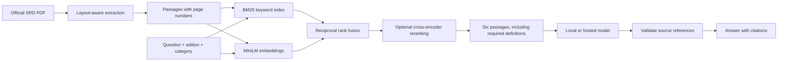

# RuleKeeper

D&D rules search and a Dungeon Master with campaign memory.

Maintained by [William C Francis](https://github.com/williamcfrancis).

[](https://github.com/williamcfrancis/rulekeeper/actions/workflows/ci.yml)

RuleKeeper answers rules questions using the official **D&D SRD 5.2.1** and links each citation to its source passage and PDF page. Its AI Dungeon Master uses the same rule index alongside the party sheet, campaign notes, and recent turns to run an adventure.

- Ask a rules question, inspect its sources, and see search and generation timings.
- Browse the compendium by title or category and bookmark useful passages.
- Create a campaign, describe an action, and roll dice when the Dungeon Master requests a check.
- Edit campaign memory, resume in the same browser, or export a campaign to JSON.
- Run rules answers locally with Qwen3, or connect a hosted provider. Dungeon Master mode uses a personal OpenAI key with GPT-5.6 Sol.


*Campaign view with sample data. [Mobile](docs/screenshot-dm-mobile.png) · [Campaign setup](docs/screenshot-dm-setup.png) · [Rules reference](docs/screenshot-desktop.png)*

## A rules question

> If a creature is both prone and grappled, can it stand up?

This needs two rules: Grappled sets Speed to 0, and Prone prevents a creature from righting itself when its Speed is 0. A search that only finds one condition, or a spell with a special exception, can produce the wrong ruling.

RuleKeeper combines keyword and semantic search, preserves the relevant definitions, and gives the answer model a small set of source passages. The displayed citations let you check the reasoning against the rulebook. This interaction is also a [regression case](docs/verification.md#prone-and-grappled).

## How retrieval works



The backend uses Python, FastAPI, FastEmbed/ONNX, BM25, and NumPy. The frontend uses React, TypeScript, and Vite.

The index contains **3,005 passages**. Their 384-dimensional embeddings are stored as a normalized NumPy matrix in `data/index/`, beside the passage metadata. Exact vector search is enough for this corpus, so there is no separate vector database to operate.

Dungeon Master turns retrieve from the same index. A separate prompt combines those rules with bounded campaign context and returns narration, rulings, a possible roll request, and updated memory. Dice results come from the backend's random-number generator. Generated stories and answers are never added to the rule index.

See [architecture and decisions](docs/architecture.md) for chunking, retrieval parameters, context selection, citation validation, and key handling.

## Quick start

Requirements: **Python 3.11–3.13** and **Node.js 22.12+**. Initial setup downloads the public PDF, embedding and reranking weights, and dependencies.

```powershell
git clone https://github.com/williamcfrancis/rulekeeper.git
cd rulekeeper
python -m venv .venv
.\.venv\Scripts\python.exe -m pip install -e ".[dev]"
.\.venv\Scripts\python.exe -m rulekeeper ingest
cd web
npm ci
npm run build
cd ..
.\.venv\Scripts\python.exe -m rulekeeper serve
```

Open **http://127.0.0.1:8000**. On Windows, **Start RuleKeeper.cmd** can launch subsequent sessions and reuse running services.

On macOS/Linux, activate `.venv` and use `pip install -e '.[dev]'`, `rulekeeper ingest`, the same npm commands, and `rulekeeper serve`.

Search, the compendium, bookmarks, and retrieval evaluation work without an API key. Until an answer provider is configured, rules questions return labeled source excerpts. Ingestion checks the PDF against a pinned checksum; stop the server before rebuilding the index.

## Start a campaign

Open **Dungeon Master**, enter a premise and party details, then connect your OpenAI API key. The connection check verifies access to `gpt-5.6-sol`. Starting or continuing an adventure makes a paid request on your OpenAI account.

The key stays in the tab's memory and clears on reload or disconnect. It passes through the local backend for OpenAI requests but is excluded from browser storage and campaign exports. Campaigns themselves are saved in localStorage; use export to keep a backup.

Each turn sends the current action, campaign memory, recent journal entries, and retrieved rules to OpenAI. The app uses `store: false`; provider retention policies still apply. See [data handling](docs/architecture.md#application-and-privacy).

## Local rules answers

The Windows setup script installs a pinned llama.cpp runtime and **Qwen3-4B Q4_K_M** in `.local/`. The model download is about 2.5 GB. Vulkan needs a compatible GPU and driver; `--backend cpu` is also available.

```powershell
.\.venv\Scripts\python.exe scripts\setup_local_model.py --backend vulkan
Copy-Item .env.example .env
```

Set these values in `.env` and restart RuleKeeper:

```dotenv
RULEKEEPER_PROVIDER=local
RULEKEEPER_LOCAL_BASE_URL=http://127.0.0.1:8081/v1
RULEKEEPER_LOCAL_MODEL=qwen3-4b
```

The Windows launcher starts the installed model server. For a separately installed llama.cpp server on another OS:

```bash
llama-server -hf Qwen/Qwen3-4B-GGUF:Q4_K_M --host 127.0.0.1 --port 8081 --alias qwen3-4b -c 6144 --jinja
```

Keep port 8081 free for that server. Other compatible servers may need different model settings. The bundled runtime is the tested local integration.

## Hosted rules answers

Set `RULEKEEPER_PROVIDER=openai`, `OPENAI_API_KEY`, and `RULEKEEPER_OPENAI_MODEL` in the server environment or `.env`. This provider uses the Responses API and incurs usage charges. Its server-side key is separate from the key entered for Dungeon Master mode.

A timeout or invalid answer produces an explicit error and the retrieved source excerpts. A failed Dungeon Master turn leaves the campaign available for retry. Hosted-provider tests use mocked responses; live paid generation has not been verified.

## Tests and evaluation

```powershell
.\.venv\Scripts\python.exe -m pytest -q --basetemp=.local/pytest-temp
.\.venv\Scripts\ruff.exe check src tests scripts
.\.venv\Scripts\python.exe -m rulekeeper evaluate --split dev
.\.venv\Scripts\python.exe -m rulekeeper evaluate --split test
.\.venv\Scripts\python.exe -m rulekeeper evaluate --split regression
```

The retrieval set has **42 questions**: six development cases, 30 test cases, and six regressions. Each question labels the required rule passages. Evaluation compares keyword, semantic, hybrid, and reranked retrieval and records recall@6, MRR, warm latency, corpus hash, and retrieved IDs.

- [Test results](eval/results.json) and [regression results](eval/results-regression.json)
- [Evaluation methodology](docs/architecture.md#evaluation)
- [Test coverage, local timings, and regression notes](docs/verification.md)

These are small, authored retrieval benchmarks. They do not measure general answer accuracy, and the questions have been inspected during development. Citation checks establish that referenced sources exist; they cannot establish that an interpretation is correct.

CI runs the Python suite, builds the frontend, indexes the real SRD, and runs desktop/mobile browser tests. With the local model running, `python scripts/verify_live.py` checks six answer examples and three abstention cases and saves complete responses for review.

## Development

Run `rulekeeper serve` from the project root and `npm run dev` inside `web/`. Vite proxies `/api` to port 8000. The production server serves the compiled frontend; API documentation is at `/docs`.

```text
src/rulekeeper/       ingestion, retrieval, generation, DM turns, API, evaluation
web/                 React application and browser tests
tests/               Python unit and API tests
eval/                labeled questions and measured results
scripts/             model setup, launcher, and local checks
docs/                architecture, test notes, and screenshots
data/                downloaded PDF and generated index (Git-ignored)
.local/              model runtime and local logs (Git-ignored)
```

`compose.yaml` provides an alternative deployment with persistent index storage and a loopback-bound port. The Docker route has not been runtime-tested. For a private hostname, set `RULEKEEPER_ALLOWED_HOSTS` as shown in `.env.example`; the browser and API must share an origin.

## Limitations

- The library contains SRD 5.2.1 only. Other books, editions, and house-rule uploads are not supported.
- The Dungeon Master handles narration and rulings, but does not enforce every combat resource or character feature. Players can edit campaign state and override a ruling.
- Models can misread sources. Weak-evidence checks are heuristic, and valid citations can accompany a wrong answer.
- PDF tables lose some structure during extraction. Open the original page for table-heavy questions.
- Campaigns and bookmarks belong to one browser. There are no accounts or shared multiplayer sessions.
- The app is intended for local use. Public hosting needs HTTPS, authentication, and rate controls.

## License

Application code is [MIT licensed](LICENSE). Source text, models, fonts, icons, and runtime components retain their own licenses; see [third-party notices](THIRD_PARTY_NOTICES.md).

This work includes material from the System Reference Document 5.2.1 (“SRD 5.2.1”) by Wizards of the Coast LLC, available at https://www.dndbeyond.com/srd. The SRD 5.2.1 is licensed under the Creative Commons Attribution 4.0 International License, available at https://creativecommons.org/licenses/by/4.0/legalcode.
