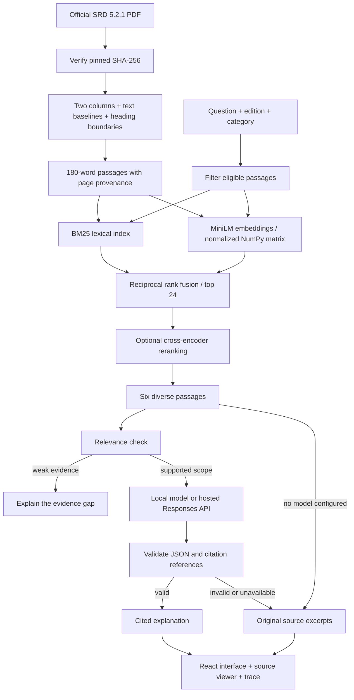

# Architecture and decisions

RuleKeeper answers rules questions from one explicit edition. An answer is useful only when the user can inspect the text that supports it.

## Ingestion

The PDF has 364 pages and two text columns. Font bounding boxes are misleading: Cambria body text and Gill Sans labels can appear to overlap even when their baselines do not. The parser groups characters using text-matrix baselines, processes the left column before the right, combines wrapped chapter headings, excludes footers, and splits on heading typography. The regression tests include the mixed-font failure case.

Chunks carry source edition, category, heading, page range, source URL, and an identifier derived from content and provenance. Long sections use 180-word windows with 32-word overlap. This is a word budget, not an exact tokenizer budget. Tables are flattened and can lose row structure; the original PDF is the authoritative view for tables. Some nested headings are represented as separate passages rather than a full hierarchy.

The corpus file uses canonical UTF-8/LF bytes so its hash matches across Windows and Unix. The loader checks the corpus fingerprint, embedding model name, and matrix dimensions. A source checksum change stops ingestion for review. Rebuild with the server stopped; indexes are not hot-swapped transactionally.

## Retrieval

- **Lexical:** BM25 with positive Robertson IDF, k1=1.5 and b=0.75. Titles appear twice in the indexed text. The positive IDF avoids zero-weight matches in very small corpora.
- **Dense:** 384-dimensional MiniLM embeddings via FastEmbed/ONNX. Normalized vectors use an exact dot product. At this corpus size, exact search is simple and fast; a vector database would add infrastructure without a measured need.
- **Hybrid:** up to 40 hits from each retrieval branch, fused with `1 / (60 + rank)`.
- **Definition preservation:** hybrid retrieval retains up to four glossary definitions explicitly named in the question, preferring condition/action names and more specific terms. These definitions survive reranking. This prevents a two-condition question from losing a required premise to a superficially relevant spell or monster ability.
- **Reranking:** optional MiniLM cross-encoder over the top 24 fused candidates. The context has six passages, avoiding multiple chunks with the same heading and starting page.
- Edition and category filters apply before ranking. Only SRD 5.2.1 is shipped.

The cross-encoder's score is not a calibrated confidence probability. Its low-score abstention threshold is a heuristic. Do not interpret a high score as proof that the question is answerable or the answer is correct.

## Generation

The model receives a bounded set of numbered passages and the question. There is no agent tool execution, open-web lookup, or incorporation of previously generated answers into the evidence.

Three provider modes are explicit:

1. `evidence`: show original passages; no generative model is invoked.
2. `local`: use a llama.cpp/Ollama-compatible Chat Completions endpoint with a JSON schema.
3. `openai`: use the Responses API, an explicitly configured model, server-side credentials, and `store=false`.

Each source passage is also divided into numbered clauses, retaining the original text. Before composing its answer, the model selects up to six clause pointers. Validation checks JSON shape, a Boolean evidence decision, citation IDs, selected clause IDs, and paragraph-level citation coverage. Clause-level citations are resolved to their passage. Selected original clauses are included in the response trace. This validates references, **not** entailment.

For a general question explicitly naming two or more conditions, generation excludes spell and monster passages unless the question also names one of those sources or refers to casting, spells, or monsters. The full retrieved set remains inspectable. This narrow heuristic avoids applying an unrelated spell's exception to a general condition interaction; ambiguous questions can still require clarification.

Malformed output, invalid references, timeouts, and provider errors return clearly labeled source excerpts. Provider error bodies are not exposed to the browser. The local Qwen3 integration enables reasoning with a bounded output budget; reasoning text is not displayed or stored by the application.

## Application and privacy

FastAPI serves both the JSON API and the production React build. Development uses Vite's same-origin API proxy. Bookmarks and recent questions live in browser localStorage; they are not user accounts or cloud storage. A question is sent to the configured answer provider only when generation is enabled. Model weights are fetched on initial setup. The local server binds to loopback by default.

Two concurrent answer requests are permitted; additional requests receive HTTP 429. Browser cancellation stops waiting for the response but may not interrupt work already running on the server. This is a local portfolio application, not a hardened multi-tenant service. Add authentication, explicit origin policy, a queue, persistent rate limits, and spend limits before exposing a hosted provider publicly.

## Evaluation

The committed question set has separate development and test labels. Required evidence groups identify a rule title and a supporting phrase; validation first ensures each group exists in the corpus. Recall@6 measures the fraction of required groups present, averaged across questions. MRR measures the rank of the first relevant passage. Both are retrieval metrics, not generated-answer accuracy.

Timings are measured after model warmup. The benchmark runs lexical, dense, hybrid, and hybrid plus reranking on identical inputs and records environment, corpus hash, and per-question retrieved IDs. Small, authored questions can favor familiar rule terminology; an independently labeled set and human review of generated claims are the next evaluation steps.

Hybrid variants include definition preservation; lexical and dense runs are the plain baselines. The development/test labels make runs reproducible, but the test questions have been inspected during development. They are not an untouched external holdout. The live generation smoke checks are acceptance examples, not an accuracy benchmark.
