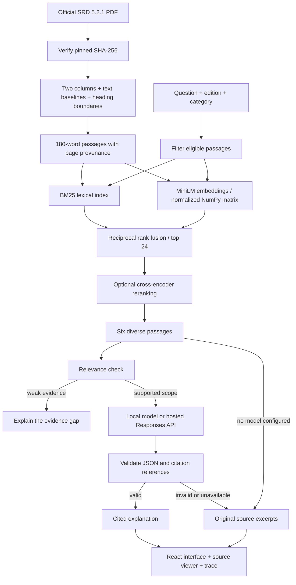
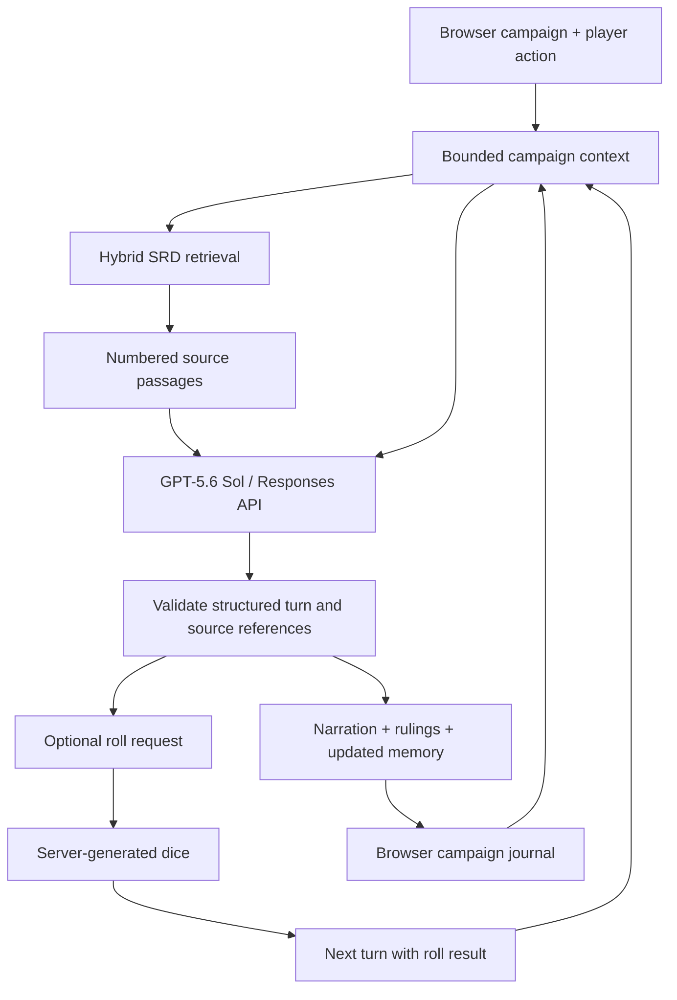

# Architecture and decisions

RuleKeeper has two generation paths over the same D&D SRD 5.2.1 index: a rules reference that explains retrieved evidence, and a Dungeon Master that uses rules evidence while running a campaign. Keeping these paths separate lets the Dungeon Master invent fiction without weakening the rules reference's source constraints.

## Ingestion

The PDF has 364 pages and two text columns. Font bounding boxes are misleading: Cambria body text and Gill Sans labels can appear to overlap even when their baselines do not. The parser groups characters using text-matrix baselines, processes the left column before the right, combines wrapped chapter headings, excludes footers, and splits on heading typography. The regression tests include the mixed-font failure case.

Chunks carry source edition, category, heading, page range, source URL, and an identifier derived from content and provenance. Long sections use 180-word windows with 32-word overlap. This is a word budget, not an exact tokenizer budget. Tables are flattened and can lose row structure; the original PDF is the authoritative view for tables. Some nested headings are represented as separate passages rather than a full hierarchy.

The corpus file uses canonical UTF-8/LF bytes so its hash matches across Windows and Unix. The loader checks the corpus fingerprint, embedding model name, and matrix dimensions. A source checksum change stops ingestion for review. Rebuild with the server stopped; indexes are not hot-swapped transactionally.

## Retrieval

- **Lexical:** BM25 with positive Robertson IDF, k1=1.5 and b=0.75. Titles appear twice in the indexed text. The positive IDF avoids zero-weight matches in very small corpora.
- **Dense:** 384-dimensional MiniLM embeddings via FastEmbed/ONNX. Normalized vectors use an exact dot product. Embeddings are stored in the local `data/index/` NumPy matrix, with passage metadata in the same index directory. At this corpus size, exact search is simple and fast; a vector database would add infrastructure without a measured need.
- **Hybrid:** up to 40 hits from each retrieval branch, fused with `1 / (60 + rank)`.
- **Definition preservation:** hybrid retrieval retains up to four glossary definitions explicitly named in the question, preferring condition/action names and more specific terms. These definitions survive reranking. This prevents a two-condition question from losing a required premise to a superficially relevant spell or monster ability.
- **Reranking:** optional MiniLM cross-encoder over the top 24 fused candidates. The context has six passages, avoiding multiple chunks with the same heading and starting page.
- Edition and category filters apply before ranking. Only SRD 5.2.1 is shipped.

The cross-encoder's score is not a calibrated confidence probability. Its low-score abstention threshold is a heuristic. Do not interpret a high score as proof that the question is answerable or the answer is correct.

## Rules-answer generation

The model receives a bounded set of numbered passages and the question. There is no agent tool execution, open-web lookup, or incorporation of previously generated answers into the evidence.

Three provider modes are explicit:

1. `evidence`: show original passages; no generative model is invoked.
2. `local`: use a llama.cpp/Ollama-compatible Chat Completions endpoint with a JSON schema.
3. `openai`: use the Responses API, an explicitly configured model, server-side credentials, and `store=false`.

Each source passage is also divided into numbered clauses, retaining the original text. Before composing its answer, the model selects up to six clause pointers. Validation checks JSON shape, a Boolean evidence decision, citation IDs, selected clause IDs, and paragraph-level citation coverage. Clause-level citations are resolved to their passage. Selected original clauses are included in the response trace. This validates references, **not** entailment.

For a general question explicitly naming two or more conditions, generation excludes spell and monster passages unless the question also names one of those sources or refers to casting, spells, or monsters. The full retrieved set remains inspectable. This narrow heuristic avoids applying an unrelated spell's exception to a general condition interaction; ambiguous questions can still require clarification.

Malformed output, invalid references, timeouts, and provider errors return clearly labeled source excerpts. Provider error bodies are not exposed to the browser. The local Qwen3 integration enables reasoning with a bounded output budget; reasoning text is not displayed or stored by the application.

## Dungeon Master turns

The Dungeon Master uses the fixed model ID `gpt-5.6-sol`, the OpenAI Responses endpoint, low reasoning effort, `store: false`, strict JSON-schema output, and a 10,000-token output ceiling. It does not inherit the separately configured rules-answer provider or silently fall back to the local model. A connection check verifies the user's access to that model without requesting generated text.

Each turn carries the campaign premise and tone, party details, editable campaign memory, the current player action, and the last 12 journal entries. Memory preserves a summary plus the current location, quests, NPCs, and inventory. Field and collection limits bound the request; the whole accumulated journal is not repeatedly sent to the provider. Recent history supplies immediate context while the summary carries older events. Summaries can omit or distort details, so the user can inspect and edit them.

The server retrieves SRD passages for the action and scene, then sends those passages alongside the campaign context. The Dungeon Master's prompt distinguishes two kinds of content:

- **Fiction:** locations, dialogue, events, and consequences created for the campaign.
- **Mechanics:** rules interpretations supported by the retrieved SRD passages, presented as separate rulings with source references.

The structured response contains narration, rulings, a possible roll request, and revised campaign memory. Validation checks the response shape and source references before the app applies the turn. Citation validation establishes that a referenced passage was retrieved, not that the interpretation is correct. Opening a saved citation fetches the canonical passage by ID from the library, so imported text is not displayed as an official source. The model can also miss a rule that was not retrieved. No generated turn, summary, or imported campaign note is promoted into the rules index.

Dice are generated separately with the backend's cryptographic random source. When a turn requests a roll, the interface carries the rolled result into the next model request so the model can narrate the outcome. The model does not supply the random result. This remains a cooperative, editable campaign: it is not a signed multiplayer game log or a complete implementation of D&D combat and resource accounting.

Campaign files use a versioned format and are stored in browser localStorage. The browser retains up to 200 journal entries and sends only the last 12 as recent history; older events rely on the editable summary. Export/import provides a portable copy; there is no campaign account or shared server database. The backend receives the necessary state on each turn and does not maintain an OpenAI conversation ID. A failed model request leaves the saved campaign intact for retry.

## Application and privacy

FastAPI serves both the JSON API and the production React build. Development uses Vite's same-origin API proxy. Campaigns, bookmarks, and recent questions live in browser localStorage; they are not user accounts or cloud storage. A rules question is sent to the configured answer provider only when generation is enabled. Dungeon Master turns send campaign context and retrieved passages to OpenAI. Model weights are fetched on initial setup. The local server binds to loopback by default.

The Dungeon Master's personal key is entered into a password field and retained only in React memory. The browser sends it in an Authorization header to the app's backend, which forwards it to the fixed OpenAI endpoint for the requested operation. It is not written into browser storage, campaign exports, or a server credential store. Disconnecting or refreshing clears it. The browser bundle contains no application-owned key. This differs from the optional hosted rules-answer path, whose separate key is configured in the server environment.

The backend necessarily handles the user's key transiently, so a deployment operator is part of the trust boundary. `store: false` disables storage of the generated response for later API retrieval; it does not establish zero retention under every [OpenAI data policy](https://developers.openai.com/api/docs/guides/your-data). Campaign export files contain the user's adventure and party details, without the API credential.

Two concurrent generation or connection-check requests are permitted; extra requests receive HTTP 429. Dungeon Master endpoints reject browser cross-origin requests, cap request bodies at 100,000 bytes before JSON decoding, and return `Cache-Control: no-store`. Trusted-host validation allows loopback hostnames by default; `RULEKEEPER_ALLOWED_HOSTS` accepts explicit additional hosts for a private deployment. The frontend and API must share an origin.

Browser cancellation stops waiting for the response but may not interrupt work already running on the server or avoid provider charges. These local safeguards are not user authentication or spending quotas. A public service still needs HTTPS, authentication, persistent rate/abuse controls, and an explicit data-handling policy.

## Evaluation

The committed question set has separate development and test labels. Required evidence groups identify a rule title and a supporting phrase; validation first ensures each group exists in the corpus. Recall@6 measures the fraction of required groups present, averaged across questions. MRR measures the rank of the first relevant passage. Both are retrieval metrics, not generated-answer accuracy.

Timings are measured after model warmup. The benchmark runs lexical, dense, hybrid, and hybrid plus reranking on identical inputs and records environment, corpus hash, and per-question retrieved IDs. Small, authored questions can favor familiar rule terminology; an independently labeled set and human review of generated claims are the next evaluation steps.

Hybrid variants include definition preservation; lexical and dense runs are the plain baselines. The development/test labels make runs reproducible, but the test questions have been inspected during development. They are not an untouched external holdout. The live generation smoke checks are acceptance examples, not an accuracy benchmark.
